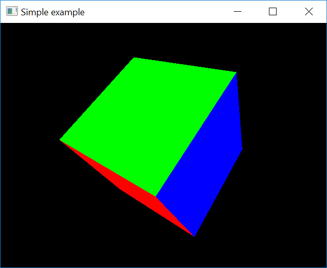

# OpenGL C++ Course

[](https://github.com/ifilot/opengl-cpp-course/actions/workflows/windows.yml)
[](https://github.com/ifilot/opengl-cpp-course/actions/workflows/linux.yml)



## Purpose and expectations
This repository contains the source code for the OpenGL C++ course. The course
teaches students how to effectively use C++ in conjunction with OpenGL to build
graphical programs. The course is made in a concise manner and I refer often to
external resources which I expect the student to read (or at least glance
through). The learning strategy employed here is "Learning by example" and
"Learning by doing". This means that example code is provided and the student is
given the opportunity to practice with the material in the form of exercises.

We assume that the student is relatively comfortable reading C++ code and has
some previous experience with it. The exercises are constructed in such a way
that the student only has to change a few lines of code. Furthermore, we expect
that the student is familiar with matrix-vector multiplication and has some
understanding of matrix mathematics. Finally, we expect that the student is a
bit familiar using the command line.

This course focuses on running OpenGL in a Windows environment using MinGW-w64,
although it should also run under Linux (I have tested it for Linux Ubuntu). If
you want to compile the programs on Linux, please read
[below](#compilation-instructions-for-linux) as the instructions for CMake
differ slightly. OpenGL and the libraries we are using are cross-platform and
thus work on Windows, Mac as well as Linux.

Feedback on this course is always much appreciated if provided in a constructive
manner. Feel free to use the Issues system on Github for this purpose.

## Lesson overview
1. [Compiling and running an OpenGL program](lesson01/README.md)
2. [Model, View, Perspective](lesson02/README.md)
3. [Creating a Shader class](lesson03/README.md)
4. [Models](lesson04/README.md)
5. [Lighting](lesson05/README.md)
6. [Textures](lesson06/README.md)
7. [Anaglyph](lesson07/README.md)

## Preparation of compilation environment

In order to compile the software under Windows, install the the MinGW-w64
toolchain via [MSYS2](https://www.msys2.org/). Next, open **MSYS2 MinGW 64-bit**
and install using `pacman` the dependencies using the following instruction

```bash
pacman -S --needed \
  mingw-w64-x86_64-toolchain \
  mingw-w64-x86_64-cmake \
  mingw-w64-x86_64-glew \
  mingw-w64-x86_64-glfw \
  mingw-w64-x86_64-glm
```

## Compilation instructions for Windows (MinGW-w64)
Open the **MSYS2 MinGW 64-bit** shell and go to the repository root folder.

Create a build directory and execute CMake; note that you need to change `XX` to the lesson of interest.

```
mkdir build
cmake -S lessonXX -B build/lessonXX -G "MinGW Makefiles"
cmake --build build/lessonXX
```

## Compilation instructions for Linux
Open a terminal, go to the root folder of the repository and use the following commands.

```
mkdir build
cmake -S lessonXX -B build/lessonXX
cmake --build build/lessonXX -j5
```

## Troubleshooting

### Framerate is very low
If you are working with Intel Integrated Graphics, open the Intel (U)HD Graphics Control Panel. Go to `3D` and add the executable to the `Select Application` window using the `Browse` button. Then under `Vertical Sync`, select `Use Driver Settings`.

Alternatively, try disabling the following line:

```
// set swap interval
glfwSwapInterval(1);
```
