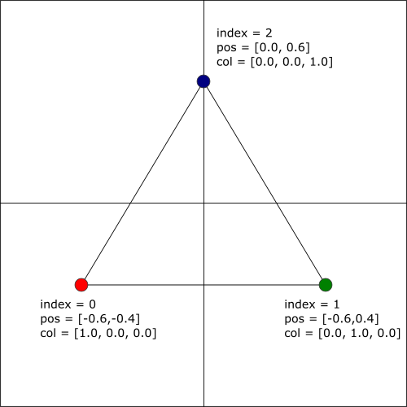

# Lesson 01 : Compiling and running an OpenGL program

## Learning goals
* Understand how to use the `glfw` library
* Understanding the program structure of an OpenGL program
* Compiling and executing your first OpenGL program
* Vertex Array Objects (VAO) and Vertex Buffer Objects (VBO)
* Conceptually understanding OpenGL Shading Language (GLSL)

## Compilation instructions
```
mkdir build
cd build
cmake ..\lesson01 -G "NMake Makefiles"
nmake
```

## Running the program
```
occ-lesson-01
```


## Explanation
This short program renders a colored triangle (as seen above). First, we need to produce a canvas on which we are going to render. This is done using the `glfw` library which generates a window for us. The `glfw` library provides a simple API for creating windows, contexts and surfaces, and receiving input and events. Starting from the `main` loop in [main.cpp](lesson01/main.cpp), you can see that we initialize a `GLFWwindow*` pointer, create a new window and make it the active context. There are a variety of other `glfw` related functions which I leave as an exercise to the reader to figure out their purpose. The [glfw documentation](http://www.glfw.org/documentation.html) is quite extensive and should provide as a proper reference.

The rendering of the triangle is executed on a graphical processing unit (GPU). This requires us to define data and routines that operate on the data. Both need to be communicated to the gpu. Data is communicated in the form of Vertex Array Objects (VAO) and Vertex Buffer Objects (VBO), whereas routines are communicated in the form of OpenGL Shading Language (GLSL) programs, called shaders. Let us first start by explaining how data is communicated to the GPU after which we follow up by explaining how we can build shaders.

### Data

The data for the single triangle is provided using two `float`-arrays, one for the vertex positions and one for the colors. A third `unsigned int`-array is used to convey the indices of the triangle. Here, it is the trivial array `{0,1,2}`, which is interpreted as that the first two/three floats of the position/color array correspond to vertex 0, the second two/three floats of the position/color array correspond to vertex 1, and so on. (how the program knows whether to take "steps" of two or three for the position and color arrays, respectively, I will explain further below). A schematic representation of our triangle is provided in the image below. By convention, the indices are placed in such a way that the face of the triangle that is pointing towards you is in a counter-clockwise fashion. (At least, that is the default setting. In principle, OpenGL allows you to chose a clockwise fashion.)



To place the triangle data on the gpu, we need to construct a VAO and a VBO for each array, here three in total. Hence, we need the following instructions:

```
GLuint vao, vbo[3];
glGenVertexArrays(1, &vao);
glBindVertexArray(vao);
glGenBuffers(3, vbo);
```

We create unsigned integers to hold references to the objects. Next, we create a single VAO. We bind that VAO and then construct three VBOs. In other words, we have constructed the buffers, but have not provided any data to them, which we will do up next.

The data is already defined in our C++ program in the form of three arrays. The data resides at the moment only on the CPU (or memory), but needs to be transferred to the GPU. This is done using the following instructions:

```
// bind vertices
glBindBuffer(GL_ARRAY_BUFFER, vbo[0]);
glBufferData(GL_ARRAY_BUFFER, 6 * sizeof(float) * 3, &vertices[0], GL_STATIC_DRAW);
glEnableVertexAttribArray(0);
glVertexAttribPointer(0, 2, GL_FLOAT, GL_FALSE, 0, 0);

// bind colors
glBindBuffer(GL_ARRAY_BUFFER, vbo[1]);
glBufferData(GL_ARRAY_BUFFER, 9 * sizeof(float) * 3, &colors[0], GL_STATIC_DRAW);
glEnableVertexAttribArray(1);
glVertexAttribPointer(1, 3, GL_FLOAT, GL_FALSE, 0, 0);

// bind indices
glBindBuffer(GL_ELEMENT_ARRAY_BUFFER, vbo[2]);
glBufferData(GL_ELEMENT_ARRAY_BUFFER, 3 * sizeof(unsigned int), &indices[0], GL_STATIC_DRAW);
glBindVertexArray(0);
```

First, we need to bind the buffer. Next, we need to copy the buffer data from the cpu to the gpu. We do this by providing a pointer to the first element (third parameter of the `glBufferData` function) and the size in bytes of the buffer (second parameter of the function). The first parameter represents the type of the buffer (`GL_ARRAY_BUFFER` for the 'raw' data and `GL_ELEMENT_ARRAY_BUFFER` for the indices). The fourth parameter informs the gpu whether to expect that the data will change significantly between draw calls or not. `GL_STATIC_DRAW` indicates that the gpu should consider the data to remain constant between draw calls.
Next, we enable the generic vertex attribute array and specify the location and data format of the array of generic vertex attributes to use when rendering. This is done by `glEnableVertexAttribArray` and `glVertexAttribPointer` respectively. In `glVertexAttribPointer`, the first parameter corresponds to the index of the generic vertex attribute array (here, index 0 for positions and index 1 for colors). The second parameter defines the type (`GL_FLOAT`), the third parameter indicates whether the data is normalized (in our case not, hence `GL_FALSE`) and the fourth and fifth parameters define the stride and offset which is 0 in both cases. Note that for the indices, we do not need to use `glEnableVertexAttribArray` and `glVertexAttribPointer` instruction.

### Shaders
Shaders are relatively small programs executed on the gpu that act upon the data as shown above. We need at least two shaders, which is the vertex shader and the fragment shader. The vertex shader acts upon the positions of the vertices, whereas the fragment shader deals with the colors. The vertex shader ensures that each vertex is transformed from its model coordinates to the screen coordinates. We use a series of matrix transformations for this. The exact nature of these matrix transformation is outside the scope of this lesson, but we will discuss this in a future lesson.

For now, we will focus on how these Shaders are defined, compiled and executed on the gpu. Shaders are defined in the OpenGL Shader Language (GLSL), which looks a lot like conventional C. We have a short GLSL program for the vertex as well as for the fragment shader, which are stored in `main.cpp` as a `char`-array:

```
/*
 * Vertex shader program
 */
static const char* vertex_shader_text =
"#version 330 core\n"
"uniform mat4 mvp;\n"
"in vec3 col;\n"
"in vec2 pos;\n"
"out vec3 color;\n"
"void main()\n"
"{\n"
"    gl_Position = mvp * vec4(pos, 0.0, 1.0);\n"
"    color = col;\n"
"}\n";

/*
 * fragment shader program
 */
static const char* fragment_shader_text =
"#version 330 core\n"
"in vec3 color;\n"
"out vec4 outcol;\n"
"void main()\n"
"{\n"
"    outcol = vec4(color, 1.0);\n"
"}\n";
```

The vertex shader and the fragment are connected in such a way that the output of the vertex shader acts as input for the fragment shader. The vertex shader receives the data defined in the previous section, both the vertex position as well as the colors. The positions are transformed to screen coordinates using the `mvp` shader whereas the colors are simply passed unaltered to the fragment shader. In the fragment shader, only an alpha channel is added to give a final 4-vector containing the color.

The two programs shown above are compiled and put on the gpu using the following instructions:

```
// load vertex shader
vertex_shader = glCreateShader(GL_VERTEX_SHADER);
glShaderSource(vertex_shader, 1, &vertex_shader_text, NULL);
glCompileShader(vertex_shader);
check_shader_error(vertex_shader, GL_COMPILE_STATUS, false, "Error: Shader compilation failed: ");

// load fragment shader
fragment_shader = glCreateShader(GL_FRAGMENT_SHADER);
glShaderSource(fragment_shader, 1, &fragment_shader_text, NULL);
glCompileShader(fragment_shader);
check_shader_error(fragment_shader, GL_COMPILE_STATUS, false, "Error: Shader compilation failed: ");

// construct program and attach shaders
program = glCreateProgram();
glAttachShader(program, vertex_shader);
glAttachShader(program, fragment_shader);
glLinkProgram(program);
check_shader_error(program, GL_LINK_STATUS, true, "Program linking failed: ");
glValidateProgram(program);
check_shader_error(program, GL_VALIDATE_STATUS, true, "Program validation failed: ");
```

A shader is created using `glCreateShader`, which takes a single argument specifying the shader type (here: `GL_VERTEX_SHADER` or `GL_FRAGMENT_SHADER`, but there exist other types). Next, the source code for the Shader is set using `glShaderSource`. Then, the code is compiled using `glCompileShader` and finally we check for any errors. After compiling and checking both the vertex as well as the fragment shader, we create a single Shader program using `glCreateProgram`. The two individual shaders are attached to this program using `glAttachShader` and we link the program. We check for errors, validate the program, and check for errors again.

## Exercises

### Exercise 01: Changing c-style arrays to std::vector
On lines 46-49 of `main.cpp`, c-style vectors are being used. Change these to `std::vector`. What is the advantage of doing so? What else do you need to change in the script to let everything work accordingly? See lines 157-172.

### Exercise 02: Changing the colors
Make the triangle a pure red color. You can do this in two ways, either by changing the color values in `main.cpp` or by changing the fragment shader. What is the main difference?

### Exercise 03: Make a square
You can build a square as a combination of two triangles. Adjust the positions, colors, and indices in such a way that they contain two triangles. Note that these two triangles share two vertices, such that there are in total only 4 distinct vertices. Can you make clever use of the indices array such that the vertices and colors array only need 8 and 12 values, respectively?

## Further reading
* A very good tutorial (with significant overlap with this lesson) is provided [here](http://www.opengl-tutorial.org/beginners-tutorials/tutorial-2-the-first-triangle/).
* More information about each of the OpenGL functions can be found at the [OpenGL references pages](https://www.khronos.org/registry/OpenGL-Refpages/gl4/html/), although if you Google any single function the first entry is probably one of the pages in this source.
