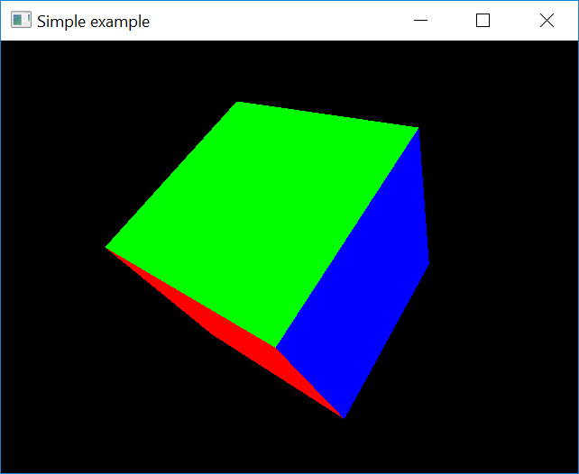
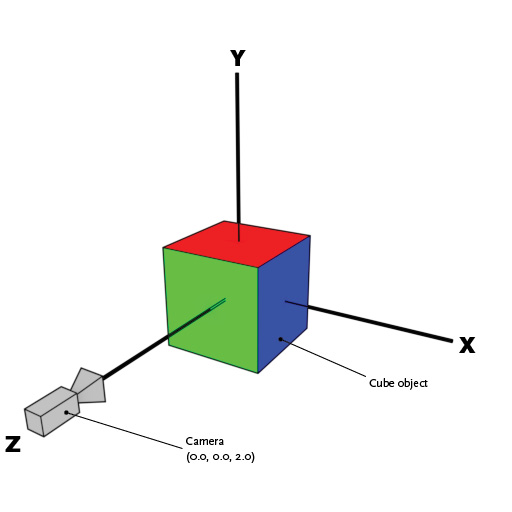

# Lesson 02 : Model, View, Perspective

## Learning goals
* Understanding the different matrix transformations involved
* Construct matrices using the GLM library
* Understand the different projection and how to build these

## Compilation instructions
```
mkdir build
cd build
cmake ..\lesson02 -G "NMake Makefiles"
nmake
```

## Running the program
```
occ-lesson-02
```

## The model
In this lesson, we are going to focus on the different matrix operations that are applied to a model in order to render it on the screen. In the [previous lesson](../lesson01/README.md), we used a flat triangle as our model. In this lesson, we are going to use a cube where each face of the cube has a different color. The cube is rotated around the (1,1,1) axes as shown by the image below



If you look at the two data arrays which make up the cube. you can see that the length of each edge of the cube is 1.0 and the cube is centered at the origin. The front face (for example) is green and the bottom face is colored red. Furthermore, you can see that each face has its own set of vertices. You might wonder why the faces cannot simply share the vertex positions. Instead of having to define 24 vertices, we only had to define 8 of them. The reason for this is as follows. A single vertex cannot have multiple color values. Since each facet has its own color, this means that we have to redefine the vertex for each color. Thus, we have 24 vertices in total.

A schematic depiction of the position and orientation of the cube, the camera and the coordinate system is provided in the image below.



## The pipeline

The whole set of matrix transformation that need to be applied to the model are represented schematically by the image below.


Our task is to convert from object space to normalized device space by constructing the `mvp`-matrix. The `glViewPort` command takes care of the final conversion to window space, upon which the image is visualized. To exemplify this process, let us consider the following `mvp`-matrix which contains the actual values as used in our [small program](main.cpp) when no rotation has been applied. (We will not do this calculation in this lesson, but please believe me that the numbers are correct)

```
1.344443, 0.000000,  0.000000,  0.000000
0.000000, 1.792591,  0.000000,  0.000000
0.000000, 0.000000, -1.002002, -1.000000
0.000000, 0.000000,  1.983984,  2.000000
```

If we apply this matrix to the **model** coordinate (-0.5f, -0.5f, 0.5f) (lower front left vertex of the cube), we obtain the following clip space coordinates:

```
-0.672222, -0.896295, 1.482983, 1.500000
```

Note that we are obtained a four-vector, while the model coordinate was given as a three-vector. We converted the model three-vector to four-vector by appending a 1.0. We will explain later why we do this. These clip space coordinates are not very intuitive, but we are almost at our final answer. The next step is to transform to normalized device coordinates by dividing the clip space vector by its fourth coordinate. We then obtain:

```
-0.448148, -0.597530, 0.988655, 1.000000
```

Note that all coordinates are between [-1,1]. This is what is meant by normalized. If the z-position is in the interval [-1,1], this means that the vertex is within the visible space of the camera. If it would be outside the interval, the vertex is not visible by the camera. Finally, we wish to know at which position the vertex will be drawn. Let us consider that our window dimensions are 640x480px. To obtain the position on the screen, we do the following:

```
x = (ndc[0] + 1.0) / 2.0 * 640 = (-0.448148 + 1.0) / 2.0 * 640 = 177
y = (ndc[1] + 1.0) / 2.0 * 480 = (-0.597530 + 1.0) / 2.0 * 480 = 97
```

This means that the lower-left-front corner of the cube will be drawn at position (177,97) with respect to the bottom-left corner of the window as can be seen from the image below.


## Matrices and vectors
All transformations are performed using 4x4 matrices. This means that the vectors upon which these matrices act have to be four-vectors. In the section above we simply stated that if we want to convert a three-vector representing the position, we simply have to add a 1.0. A more general rule of thumb is as follows.

__Consider the four-vector `(x,y,z,w)`: If the vector represents a point in space, use `w = 1.0`. If it represents a direction, use `1w = 0.0`.__

The beauty of this representation is that if we apply a translation matrix to a direction, nothing would happen (i.e. the direction would be the same). However, the operation would result in the expected behavior for a point.

The following matrices are common transformations in OpenGL:
* `Model` matrix (transforms from model space to world space)
    * `Scaling` matrix
    * `Rotation` matrix
    * `Translation` matrix
* `View` matrix (position and orientation of the camera; transforms from world space to eye space)
* `Projection` matrix (can be orthogonal or perspective; transforms from eye space to clip space)

The order in which the above matrices have to be applied is first the model matrix, then the view matrix and finally the perspective matrix. For the model matrix, first a scaling operation, then a rotation and finally a translation should be applied. If you perform the operations in another order, you will get very interesting result. For example, what happens when you first translate the object and then rotate? The object would make an arc around the origin rather than around the objects center.
To combine all operations into a single matrix (i.e. the `mvp`-matrix, you can multiply the matrices). Remember that the multiplication needs to be done in reverse order with respect to how these operations are applied. To construct the `mvp`-matrix, the formula would be as follows:

```
mvp = projection * view * translate * rotate * scale;
```

All matrices can be constructed using the `glm` library, which is described in further detail below. If you are interested, have a look at the [website for the library](https://glm.g-truc.net/).

### Scaling matrix
With a scaling matrix, you can increase or decrease the scale of your model. The scaling does not necessarily have to be uniformly (i.e. the same in each direction). You can for instance choose to only scale in the z-direction. The scaling matrix can be generated using `glm::scale(glm::vec3(x, y, z));` which takes as its argument a three-vector with a scaling constant for x,y, and z. If you supply 1.0 for x,y,z, you will essentially obtain the identity matrix which does nothing.

### Rotation matrix
For define a rotation, you need an rotation angle and a rotation axis. The matrix can be constructed using `glm::rotate(angle, glm::vec3(x, y, z));`, where the first argument is the angle and the second argument is the rotation axis. If you have `#define GLM_FORCE_RADIANS` at the top of you script (see [main.cpp](main.cpp)), all the angles have to be in radians.

### Translation matrix
Translation is perhaps the simplest instruction. It moves the object a specified distance in the x,y and z direction. You can build the translation matrix with `glm::translate(glm::vec3(x, y, z));`, where its first argument is a three-vector containing the distance the object should move in the x, y and z direction.

### View matrix
The view matrix deals with the orientation and position of the camera. You can for instance imagine that in a first-person shooter, you would simply change the position of the camera when you move around your character and change the cameras orientation when you look around. The view matrix takes three arguments, all three as three-vectors: `glm::lookAt(position, focus, up);`. The first argument is the position of the camera, the second argument is the focus of the camera (i.e. at which point in space the camera is looking at) and the final argument is the up direction. For example, in our script, we have chosen the positive y-direction to be the up-direction.

### Projection matrix
You could say that the projection matrix deals with the lens of the camera. There are two kind of projections: perspective and orthographic. Using orthographic projection means everything will be projected to a 2D plane and objects will not be affected by the distance and/or angle from which you see them. In the perspective view, objects which are far away are smaller than those nearby. Perspective viewpoints give more information about depth and are often easier to view because you use perspective views in real life. The image below depicts the idea. Also have a look at this [website](http://www.songho.ca/opengl/gl_projectionmatrix.html) for more details.

  
[Image source](https://gamedev.stackexchange.com/questions/76111/open-gl-perspective-projection-vs-orthographic-projection)

#### Orthographic projection

The orthographic projection can be constructed using `glm::ortho(left, right, bottom, top, znear, zfar)`. Its six parameters are floats defining the boundary values. Typically, you use -1 and 1 for the `bottom` and `top` variables, respectively. For `left` and `right`, you use the aspect ratio of your viewport (i.e. in our case, that is the same as the aspect ratio as our window). The `znear` and `zfar` variables define how near and how far you can see. For example, a value of 0.1 for znear means that any object closer to the camera than 0.1 will not be drawn.

#### Perspective projection
The perspective projection can be constructed with `glm::perspective(fovy, aspect, near, far);`. The first parameter gives the field of view angle. The angle is defined in radians if you have set `#define GLM_FORCE_RADIANS`. In our script, we have used a field of view angle of 45 degrees (pi/4 in radians). Note that the glm library has [handy functions](https://glm.g-truc.net/0.9.4/api/a00145.html) to define particular variables for us. The next argument is the aspect ratio. The third and fourth argument are the near and far boundaries, respectively. These are similar to `znear` and `zfar` for orthographic projection.

#### Other projections
There are other ways to construct the projection matrix. Have a look at the [glm matrix transformations website](https://glm.g-truc.net/0.9.4/api/a00151.html). For example, there also exists `glm::infinitePerspective` and `glm::perspectiveFov`.

### Reverse operations
A special note should be made about these matrix operations. Any matrix operations is reversible. You can perform the inverse operation by taking the matrix inverse and applying this to your model. The matrix inverse can be easily calculated using `glm::inverse(mat)`. Do note that this is a relatively expensive operation.

For example, let us assume you have defined a translation of +3.0 in the x direction using

```
translate = glm::translate(glm::vec3(3.0f, 0.0f, 0.0f))
```

The inverse of this matrix is generated using

```
translate_inv = glm::inverse(translate)
```

The matrix `translate_inv` would then define a translation of -3.0 in the x-direction.

### Outputting matrices
At this point you might be curious about the actual numerical values of the matrices. This can also be handy for debugging purposes. You can the numerical values to the console using 

```
std::cout << glm::to_string(mat) << std::endl;
```

Do not that you have to use 

```
#include <glm/gtx/string_cast.hpp>
```

at the top of your script. See [this page](https://glm.g-truc.net/0.9.4/api/a00205.html) for more information. There is a minor problem with this procedure. Since we are generating these matrices in a loop, you would output the matrix values every iteration and flood your console. You can resolve this by either using some flag to check whether the matrix has already been printed or exit the program after the first iteration.

## Exercises
To further practice with the learning goals of this lesson. A series of exercises are introduced as can be found below. Solution to these exercises are given [here](solutions.md).

### Exercise 01: Field of View
Change the Field of View angle to 90 degrees. What happens?

### Exercise 02: Orthographic projection
Change the projection matrix to orthographic projection. What difference do you see? What happens when you set the `left` and `right` to -1.0 and 1.0, respectively rather than the aspect ratio of the screen?

### Exercise 03: Scaling the object
Scale the object in the y-direction as function of time. Use a function such as `sin^2(t) + 1.0f)` to get values between 1.0 and 2.0. You can use `std::sin(x)` for the sine and `std::pow(x, 2.0f)` for the square. Have a look at the reference page for the [sine](https://en.cppreference.com/w/cpp/numeric/math/sin) and for the [pow](https://en.cppreference.com/w/cpp/numeric/math/pow) function if you have trouble implementing them.

### Exercise 04: Moving the camera
Instead of rotating the object, you can also rotate the camera. Rotate the camera as function of time around the x-axis, use a function such as

```
glm::vec3 pos = glm::vec3(0.0f, std::sin((float) glfwGetTime()) * 2.0f, std::cos((float) glfwGetTime()) * 2.0f);
```

Remember that you are rotating the whole camera, so you need to update the `up` vector as well. A nice trick to do this is to define an `out` vector that specifies the view direction. In combination with a `right` vector, you can then calculate the `up` vector using the cross product as follows

```
glm::vec3 up = glm::cross(right, out);
```

This exercise is actually quite complicated, so if you cannot figure it out in one go, feel free to look at the [solutions](solutions.md#exercise-04-moving-the-camera) and try to reverse-engineer it.

## Additional reading
* A very good tutorial (with significant overlap with this lesson) is provided [here](http://www.opengl-tutorial.org/beginners-tutorials/tutorial-3-matrices/)
* This [tutorial](https://learnopengl.com/Getting-started/Coordinate-Systems) on coordinate systems
* This [StackOverflow post](https://stackoverflow.com/questions/4124041/is-opengl-coordinate-system-left-handed-or-right-handed)
* An explanation of the [mathematics behind the matrices](http://www.songho.ca/opengl/gl_projectionmatrix.html)
* Very detailed [blog post](http://www.songho.ca/opengl/gl_projectionmatrix.html) on projection matrices
* [GLM library website](https://glm.g-truc.net/)
