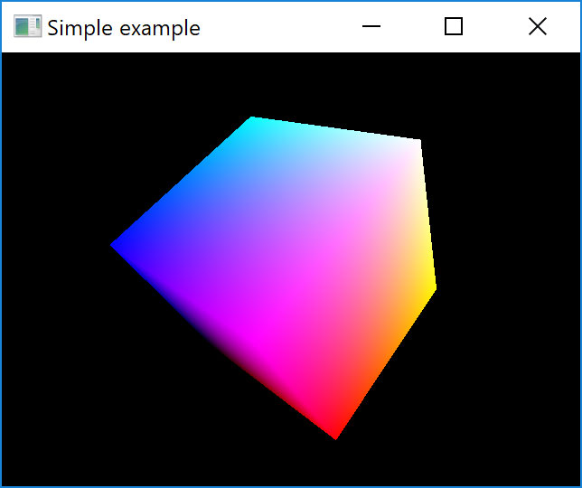

# Lesson 03 : Delving into Shaders

## Learning goals
* Understand how to compartmentalize the Shader routines in a class
* Understand how Shader programs work and how to edit them

## Compilation instructions
```
mkdir build
cd build
cmake ..\lesson03 -G "NMake Makefiles"
nmake
```

## Running the program
```
occ-lesson-03
```

If the compilation is not working or if the program shows weird behavior, please check the [troubleshooting section](../README.md#troubleshooting).

## Exercises

To further practice with the learning goals of this lesson. A series of exercises are introduced as can be found below. Solution to these exercises are given [here](solutions.md).

### Exercise 01: Use the position of the cube for the color
Our cube is centered at the origin and has an edge size of 1.0. Colors are defined as three-vectors between `(0,0,0)` and `(1,1,1)`, so our cube represents the whole color space. Transfer the position variable from the vertex shader to the fragment shader and add `(0.5,0.5,0.5)` to it. Use the result for the color to obtain an image as follows.



### Exercise 02: Move the cube to the right
Move your cube by 1.0 to the right by only changing the vertex shader.

## Additional reading
* A very in-depth [Tutorial](https://learnopengl.com/Getting-started/Shaders) about Shaders
