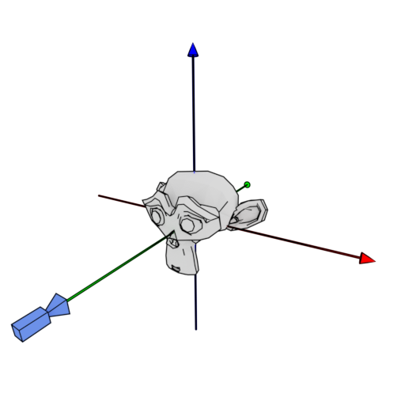

# Lesson 04 : Models

## Learning goals
* Load models from Wavefront files into OpenGL
* Understand vertex normals

## Compilation instructions
```
mkdir build
cd build
cmake ..\lesson04 -G "NMake Makefiles"
nmake
```

## Running the program
```
occ-lesson-04
```


## Loading models



## Exercises

To further practice with the learning goals of this lesson. A series of exercises are introduced as can be found below. Solution to these exercises are given [here](solutions.md).
