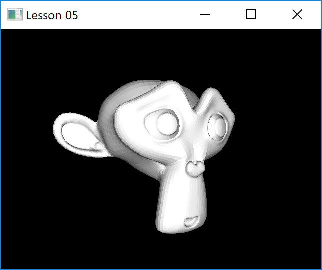

# Lesson 05 : Lighting

## Learning goals
* Understand Phong Lighting (ambient, diffuse and specular)
* Using Phong Shader

## Compilation instructions
```
mkdir build
cd build
cmake ..\lesson05 -G "NMake Makefiles"
nmake
```

## Running the program
```
occ-lesson-05
```



## The Phong Model

## Exercises

To further practice with the learning goals of this lesson. A series of exercises are introduced as can be found below. Solution to these exercises are given [here](solutions.md).
