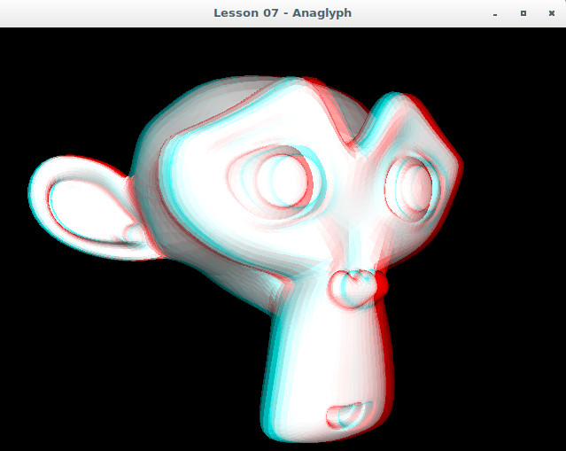

# Lesson 07 : Anaglyph

## Learning goals
* Understand how anaglyph stereographic rendering works

## Compilation instructions
Build from the repository root in a MinGW-w64 shell.

```
mkdir build
cmake -S lesson07 -B build/lesson07 -G "MinGW Makefiles"
cmake --build build/lesson07
```

## Running the program
```
occ-lesson-07
```
If the compilation is not working or if the program shows weird behavior, please check the [troubleshooting section](../README.md#troubleshooting).



## Exercises

To further practice with the learning goals of this lesson. A series of exercises are introduced as can be found below. Solution to these exercises are given [here](solutions.md).
